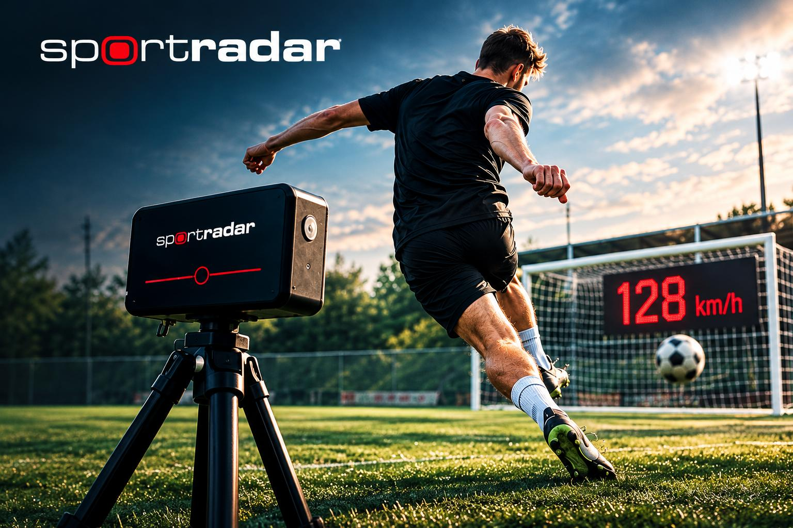

# SPORTRADAR
 

 
## Präzise Geschwindigkeitsmessung seit 1999
 
>Professionelles Sportradar zur präzisen Messung von Schuss- und Ballgeschwindigkeiten für Vereine, Trainer, Schulen und Sportveranstaltungen.

 

 ---
 
## Über SPORTRADAR

 
>Seit über 25 Jahren steht SPORTRADAR für zuverlässige und präzise Geschwindigkeitsmessung im Sport.
>
>Ob beim Training, Vereinsfest, Turnier oder bei öffentlichen Veranstaltungen – SPORTRADAR liefert professionelle Messergebnisse in Echtzeit und sorgt für spannende Wettbewerbe sowie eine objektive Leistungsbewertung.
 
---

 

## Einsatzbereiche
 
- Fußball
- Handball
- Eishockey
- Tennis
- Baseball
- Vereinsveranstaltungen
- Wettbewerbe
 
---
 
## Weitere Informationen
 
📧 E-Mail: sport_contact@web.de
 
📸 Instagram: @shotspeedliga2026
 
🌐 Verkaufsseite: HIER SPÄTER DEN LINK EINFÜGEN
 
---
 
**SPORTRADAR – Präzision seit 1999**
