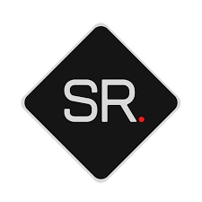
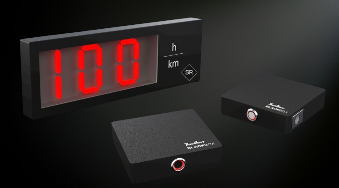

# SPORTRADAR
 

 
## Präzise Geschwindigkeitsmessung seit 1999
 
 Professionelles Sportradar zur präzisen Messung von Schuss- und Ballgeschwindigkeiten für Vereine, Trainer, Schulen und Sportveranstaltungen.

## Produktbilder
 
### Produktbild 1
 

 ---
 
## Über SPORTRADAR
 
Seit über 25 Jahren steht SPORTRADAR für zuverlässige und präzise Geschwindigkeitsmessung im Sport.
 
Ob beim Training, Vereinsfest, Turnier oder bei öffentlichen Veranstaltungen – SPORTRADAR liefert professionelle Messergebnisse in Echtzeit und sorgt für spannende Wettbewerbe sowie eine objektive Leistungsbewertung.
 
---

### Produktbild 2
 

``
